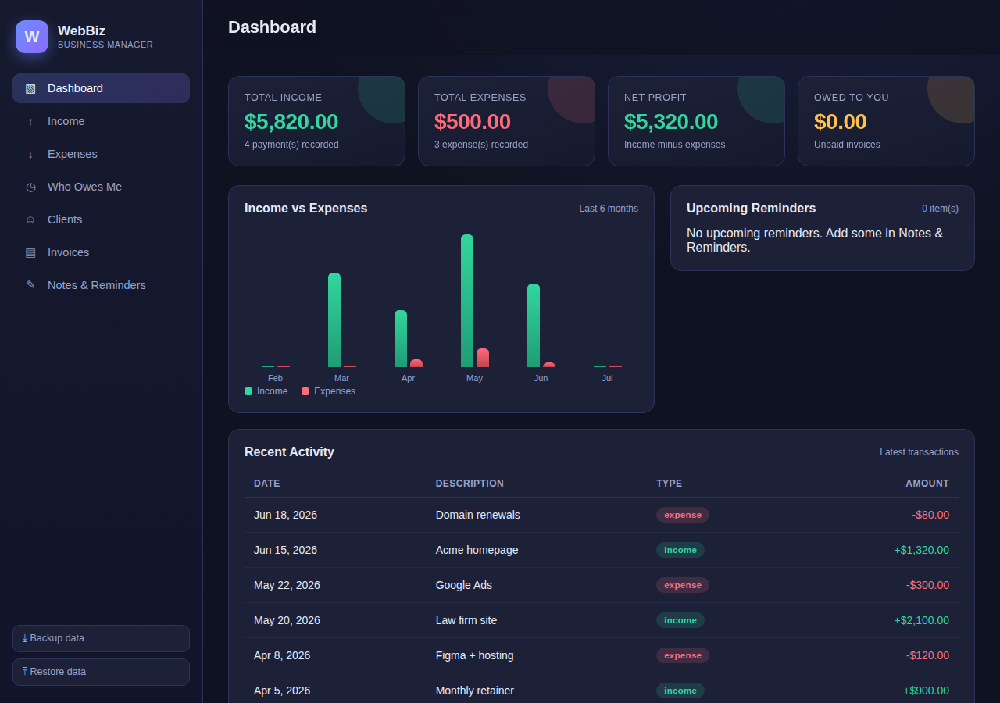

# WebBiz — Website Business Manager

A complete, self-contained app to run your website/freelance business. It gives
you a money dashboard, income & expense tracking, an "who owes me money" view,
a client book, an automatic invoice generator, and a notes/reminders board.

No installation, no database, no server. Everything runs in your browser and
saves to your device automatically.



## How to run it

**Option A — just open it (simplest):**
Double-click `index.html`, or drag it into your web browser (Chrome, Edge,
Firefox, Safari). That's it.

**Option B — run a tiny local server (recommended if some browsers block local files):**
```bash
# from inside this folder
python3 -m http.server 8000
# then open http://localhost:8000 in your browser
```

## Features

### 📊 Dashboard
The home screen shows everything money-related at a glance:
- **Total income, total expenses, net profit** and **money owed to you**
- A 6-month **income vs. expenses** bar chart
- **Upcoming reminders** pulled from your notes
- **Recent activity** feed of your latest transactions

### ↑ Income & ↓ Expenses
Log every payment you receive and every business cost. Categorize them, attach a
client, and see running totals. Editable and deletable at any time.

### ◷ Who Owes Me
Automatically lists every **unpaid invoice**, grouped by client, with overdue
flagging. One click to mark an invoice paid — which instantly records the income.

### ☺ Clients
A simple address book of the people and companies you work with. Each client
shows how much they've **paid** and how much they still **owe**. Client details
(name, company, email, address) auto-fill onto their invoices.

### ▤ Invoices (auto-generated)
- Invoice numbers are **generated automatically** (configurable prefix + counter)
- Add line items; **subtotal, tax and total are calculated for you** in real time
- **Print or Save as PDF** with one click (uses your browser's print dialog)
- Marking an invoice **paid** records the income on your dashboard automatically
- Business name, currency, tax rate and numbering are all configurable in ⚙ Settings

### ✎ Notes & Reminders
Jot down what you're working on or need to do. Pin important notes, check them
off when done, and add a due date to turn any note into a **reminder** that
appears on your dashboard (with overdue highlighting).

## Your data

- Everything is stored locally in your browser (`localStorage`) and persists
  between sessions on the same browser/device.
- Use **⤓ Backup data** in the sidebar to download a `.json` copy of everything,
  and **⤒ Restore data** to load it back (e.g. on another computer).
- Because data is per-browser, backing up regularly is a good habit.

## Project structure

```
index.html         # app shell (sidebar, main area, modal)
css/styles.css     # all styling (dark theme, responsive)
js/store.js        # data layer over localStorage (single source of truth)
js/ui.js           # shared helpers: money/date formatting, modal, toasts
js/views.js        # dashboard, income, expenses, debts, clients, notes
js/invoice.js      # invoice list, builder, PDF/print, settings
js/app.js          # navigation + one delegated click handler for all actions
```

## Tech

Plain HTML, CSS and vanilla JavaScript — no build step and no external
dependencies, so it works offline and will keep working for years.
